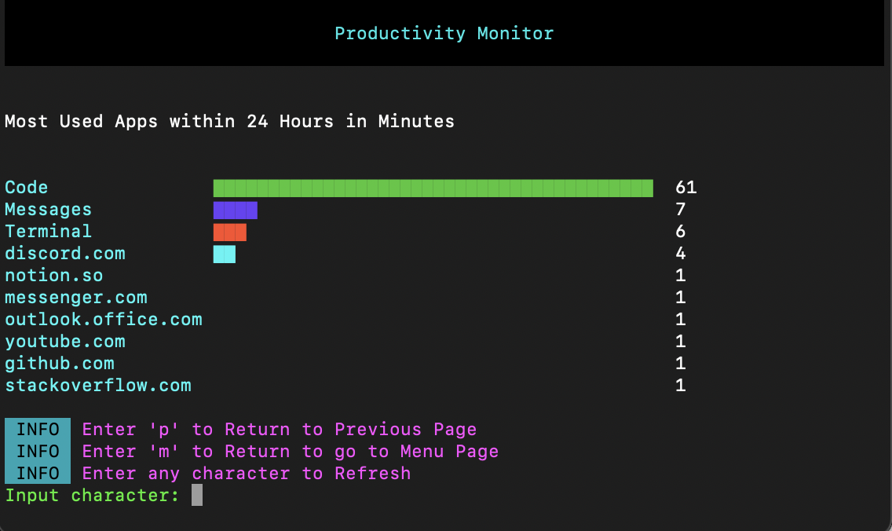

<h1 align="center">
  Productivity Monitor
  <br>
</h1>

<h4 align="center">A Terminal Interface & Script to Bring Awareness to Your Usage</h4>


<div align="center">
    
    
    
    

</div>

<p align="center">
<a href="#about-the-project">About The Project</a> •
  <a href="#key-features">Key Features</a> •
  <a href="#how-to-use">How To Use</a> •
  <a href="#download">Download</a> •
  <a href="#license">License</a>
</p>



## About The Project
When trying to focus on a task, we sometimes get distracted and lose sight of why we got on the computer in the first place. All we need is a reminder to make us concious of our usage to get back to work.  
There are many focus tracking applications, however, they usually cost money or lack the feature to send reminders. Productivity Monitor allows you to track your usage, see your data as bar graphs, set intervals on how often you want to get alerts, and ofcourse getting an alert with your most usaged application or website within an interval.


## Key Features

| Feature          | Description                                         |
|------------------|-----------------------------------------------------|
| 🛠 Accurate Tracking | Tracks every second and only active foreground window (can be app or site) is retrieved, background tasks are ignored. |
| :warning: Alerts | Get an alert of your most used application or website within a given interval |
| :bar_chart: Statistics and Charts | Bar charts of daily/weekly/all time app and site usage |
| 🪀 Easy to use    | Simple terminal user interface to make setup easy |
| 🤹 Completely Local and Free | Project is open source, does not require any personal details, and data is saved on your computer |
| 🛠 Configurable   | Options to set alert interval, see session data, and turn alerts off for tracking |


## How To Use

To clone and run this application, you'll need [Git](https://git-scm.com) and [Go](https://go.dev/doc/install) installed on your computer. From your command line:

```bash
# Clone this repository
$ git clone https://github.com/IshmamF/productivity-monitor.git

# Go into the repository
$ cd productivity-monitor

# Install dependencies
$ go mod tidy

# Run the app
$ go run .
```

**Note**
> Database is stored in `$HOME/.local/share`

## Download

You can [download](https://github.com/IshmamF/productivity-monitor/raw/main/productivity-monitor.zip) the latest installable version of Productivity Monitor for macOS. <br> 

**Note**
> Once you've unzipped, if macOS doens't allow you to run application due to not being able to scan, you need to: <br> right click -> Select Open With -> Click Terminal -> Click Open / Allow on the popup.

## 📜 License

This software is licensed under the [MIT](https://github.com/nhn/tui.editor/blob/master/LICENSE) © [NHN Cloud](https://github.com/ishmamf).

---

> LinkedIn [Ishmam Fardin](https://www.linkedin.com/in/ishmam-fardin/) &nbsp;&middot;&nbsp;
> GitHub [@ishmamf](https://github.com/ishmamf)